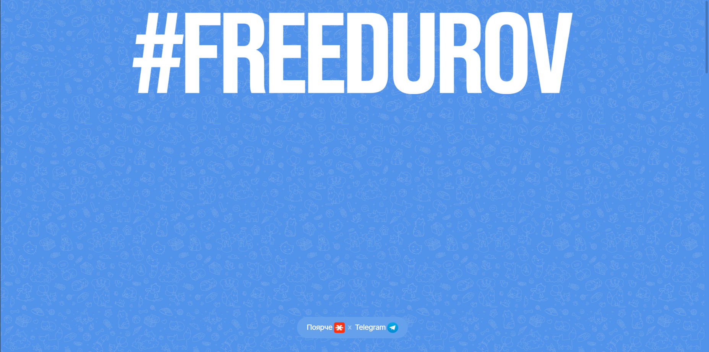
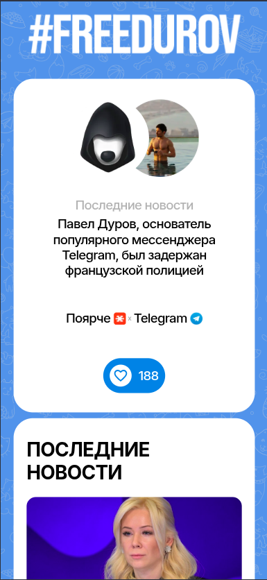

# 🚀 Pavel Durov Support Landing

A landing page project created in support of **Pavel Durov**.  
Built with **Next.js (TypeScript)**, styled with **SCSS**, powered by **Sanity CMS**, and deployed on **Vercel**.

---

## ✨ Preview

👉 Live demo: [https://your-vercel-app.vercel.app](https://your-vercel-app.vercel.app)

### Desktop


### Mobile


---

## 🛠 Technologies

- ⚛ **Next.js** — React framework for production
- 🟦 **TypeScript** — typed JavaScript
- 🎨 **SCSS (Sass)** — styling
- 📡 **Sanity.io** — headless CMS for content management
- ▲ **Vercel** — deployment and hosting

---
## 📂 Project structure
```
freedurov/
├── app/                
│   ├── admin/            # Admin section
│   ├── components/       # UI components used across the app
│   ├── index.scss        # Global SCSS styles for the app
│   ├── layout.tsx        # Root layout
│   ├── not-found.tsx     # 404 page
│   └── page.tsx         
├── docs/                 
├── public/
├── sanity/               # Sanity CMS configuration
├── src/                  # Additional logic and modules
│   ├── actions/
│   ├── data/ 
│   ├── models/
│   ├── resources/
│   ├── shared/
│   ├── styles/
│   ├── utils/
├── tsconfig.json
└── package.json

```

---

## ⚡ Installation & Usage
Clone the repository:
```bash
git clone https://github.com/makaksel/freedurov.git
cd freedurov
```

Install dependencies:
```bash
npm install
```

Run development server:
```bash
npm run dev
```

Build for production:
```bash
npm run build
npm start
```

***

# 🚀 Лендинг в поддержку Павла Дурова

Проект лендинга, созданный в поддержку **Павла Дурова**.

Создан на **Next.js (TypeScript)**, стилизован с помощью **SCSS**, работает на **Sanity CMS** и развёрнут на **Vercel**.

---

## ✨ Предварительный просмотр

👉 Демонстрация: [https://your-vercel-app.vercel.app](https://your-vercel-app.vercel.app)

### Десктоп


### Мобильная версия


---

## 🛠 Технологии

- ⚛ **Next.js** — фреймворк React для продакшена
- 🟦 **TypeScript** — типизированный JavaScript
- 🎨 **SCSS (Sass)** — стилизация
- 📡 **Sanity.io** — headless CMS для управления контентом
- ▲ **Vercel** — развёртывание и хостинг

---
## 📂 Структура проекта
```
freedurov/
├── app/
│ ├── admin/            # Раздел администратора
│ ├── components/       # Компоненты пользовательского интерфейса, используемые в приложении
│ ├── index.scss        # Глобальные стили SCSS для приложения
│ ├── layout.tsx        # Корневой макет
│ ├── not-found.tsx     # Страница 404
│ └── page.tsx
├── docs/
├── public/
├── sanity/             # Конфигурация Sanity CMS
├── src/                # Дополнительная логика и модули
│ ├── actions/
│ ├── data/
│ ├── models/
│ ├── resources/
│ ├── shared/
│ ├── styles/
│ ├── utils/
├── tsconfig.json
└── package.json

```

---

## ⚡ Установка и использование
Клонируйте репозиторий:
```bash
git clone https://github.com/makaksel/freedurov.git
cd freedurov
```

Установите зависимости:
```bash
npm install
```

Запустите сервер разработки:
```bash
npm run dev
```

Сборка для прода:
```bash
npm run build
npm start
```